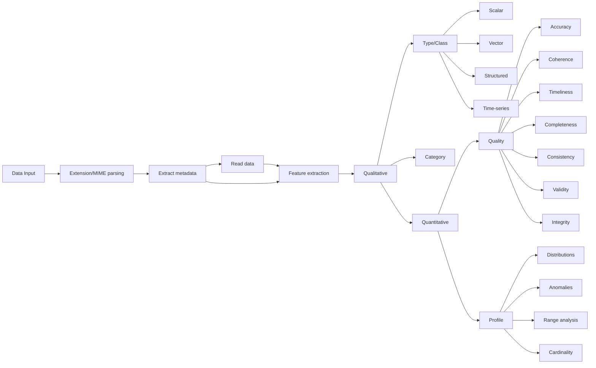

# characterize
Assess data across common dimensions.

## Usage
```bash
$ characterize --help
```


## Data Model


### Signal/feature data quality
- _Accuracy_: degree to which data values reflect attributes of real-life entities.
- _Completeness_: extent of null attributes.
- _Timeliness_: newness of information.


### Classification
- _Precision_: measures correctness of _positive_ predictions.
- _Recall_: highlights how many _positives_ are captured within the dataset.
- _F1 Score_: balances precision and recall.

## Contributing
### Installation
We use [Poetry](https://python-poetry.org/docs/#installing-with-the-official-installer) for dependency management and also recommend versioning Python with [PyEnv](https://github.com/pyenv/pyenv?tab=readme-ov-file#a-getting-pyenv).

```bash
$ poetry install
$ poetry env activate
$ characterize --help
```
